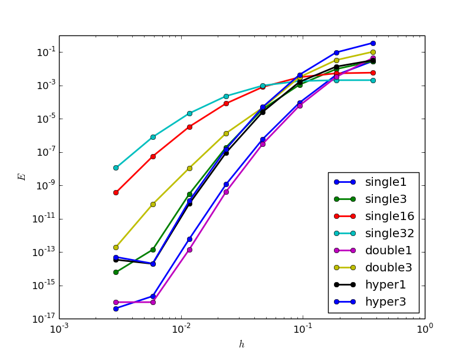

##### REQuad (Richardson Extrapolation Quadrature)

Many interesting phyiscal and mathematical problems can be solved accurately
through boundary element methods. However, oftentimes, these methods
produce boundary integrals that have singularities in the integrand. This is
an attempt to produce a black-box quadrature process for a broad class of 
these singular integrals. 

The plot below shows the convergence of the error as the distance to the 
boundary is refined for quadrature of Poisson equation kernels. 
The integrands are multiplied by a polynomial to better represent the true
situation encountered in a boundary element method. The number in the legend \
indicates the order of the polynomial. 
The name in the legend indicates which integral:
* single = Single Layer Potential
* double = Double Layer Potential
* hyper = Hypersingular 

